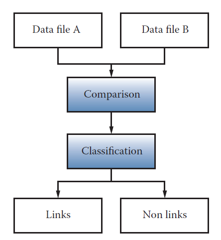

```{r setup, include=FALSE}
knitr::opts_chunk$set(echo = TRUE)
```

## Conceptos y terminología
  
  - Datasets: Colección de datos, comparte el mismo conjunto de atributos o propiedades 
  - Análisis de datos: El análisis de datos es el proceso de examinar datos para encontrar hechos, relaciones, patrones, ideas y/o tendencias. El objetivo general del análisis de datos es apoyar una mejor toma de decisiones.

> Actividad 1

Para las siguientes áreas explore e identifique posibles datasets y algunos objetivos para el análisis de datos:

  + Banca
  + Salud
  + Educación
  + Telecomunicaciones
  + Agricultura
  + Comercio exterior
  
Explore si existen datos abiertos en Bolivia respecto su respuesta.

## Analítica de datos

La analítica de datos es un término más amplio, incluye la gestión del ciclo de vida completo de los datos, que abarca la recopilación, limpieza, organización, almacenamiento, análisis. El término incluye el desarrollo de métodos de análisis, técnicas científicas y
herramientas. 

+ En entornos orientados a los negocios, los resultados de la analítica de datos pueden reducir los costos operativos y facilitar la toma de decisiones estratégicas.
+ En las ciencias, la analítica de datos puede ayudar a identificar la causa de un fenómeno para mejorar la precisión de las predicciones.
+ En entornos basados en servicios como las organizaciones del sector público, puede ayudar a fortalecer el enfoque en la prestación de servicios de alta calidad mediante la reducción de costos.


  + Valor: Compresión en retrospectiva, conocimiento/percepción, previsión 
  + Complejidad: Baja, media, alta

### Análisis descriptivo

El análisis descriptivo se lleva a cabo para **responder preguntas sobre eventos que ya han ocurrió**. Esta forma de análisis **contextualiza** los datos para generar información. 

  - Estadística descriptiva
  - Inferencia descriptiva

### Análisis de diagnóstico

El análisis diagnóstico tiene como objetivo determinar la **causa** de un fenómeno que **ocurrió en el pasado**. usando preguntas que se enfocan en la razón detrás del evento. El objetivo de este tipo de análisis es determinar **qué información está relacionada con el fenómeno** para permitir responder preguntas que buscan determinar por qué ha ocurrido algo.

### Análisis predictivo

El análisis predictivo se lleva a cabo en un intento de determinar el **resultado de un evento que podría ocurrir en el futuro**. Con el análisis predictivo, la información se mejora con significado generar conocimiento que transmita cómo se relaciona esa información. La fuerza y magnitud de las asociaciones forman la base de los modelos que se utilizan para generar futuros predicciones basadas en eventos pasados. Es importante entender que los **modelos utilizados para el análisis predictivo tiene dependencias implícitas** en la condiciones bajo las cuales el pasado ocurrieron los hechos. Si estas condiciones subyacentes cambian, entonces los modelos que hacen predicciones necesitan ser actualizadas.

  + Inferencia predictiva
  + Inferencia causal

### Análisis prescriptivo

El análisis prescriptivo se **basa en los resultados del análisis predictivo** al prescribir acciones que se deben tomar. El enfoque no es solo en qué opción prescrita es mejor seguir. En otras palabras, el análisis prescriptivo proporciona resultados sobre los que se puede razonar, porque incorporan elementos de comprensión situacional. Por lo tanto, este tipo de análisis puede utilizarse para obtener una ventaja o mitigar un riesgo.

> Actividad 2

Determinar el tipo de análisis que se requiere en las siguientes solicitudes:

  - El INRA quiere conocer el efecto que tiene la titulación de tierras sobre los ingresos de los productores agropecuarios. 
  - UNICEF quiere conocer el nivel de pobreza que existe en los hogares con NNA y los factores que explican estos resultados. 
  - UNFPA quiere saber el efecto que tuvo sus campañas de violencia que realizó en las universidades públicas del país 
  - KAS quiere conocer los valores democráticos de los jóvenes 
  - OIM quiere saber que tipos de mensajes de empleo están vinculados a trata y tráfico para monitorear 

## Minería de datos

Es el análisis de **conjuntos de datos** (a menudo grandes) para encontrar **relaciones insospechadas** (conocimiento) y resumir los datos de **formas novedosas** que sean **comprensibles y útiles** para el propietario/usuario de los datos.

<p style='text-align: right;'> Principles of Data Mining (Hand et.al. 2001) </p>

### Datos

  * se refieren a instancias únicas y primitivas (single objetos, personas, eventos, puntos en el tiempo, etc.)
  * describir propiedades individuales
  * a menudo son fáciles de recolectar u obtener (por ejemplo, cajeros de escáner, internet, etc.)
  * no nos permiten hacer predicciones o pronósticos

### Conocimiento

  * (Características) se refiere a clases de instancias (conjuntos de ...)
  * (Forma) describe patrones generales, estructuras, leyes,
  * (Declaración) consta de la menor cantidad de declaraciones posibles
  * (Proceso) a menudo es difícil y lleva mucho tiempo encontrar u obtener
  * (Acciones) nos permite hacer predicciones y pronósticos

### Requerimientos para la MD

  * Disponibilidad para aprender 
  * Mucha paciencia
    - Interactúa con otras áreas
    - Preprocesamiento de datos 
  * Creatividad
  * Rigor, prueba y error

## knowledge discovery in databases (KDD)

> Descubrimiento del conocimiento en datos


## Captura y preservación

Se refiere al proceso de obtener la información de las distintas fuentes posibles y luego pasar a un proceso de preservación. 

### Fuentes convencionales

  + Censos
  + Encuestas
  + Registros administrativos
  
### Tipos de estudios

  + Diseños experimentales
  + Encuestas por muestreo
  + Estudios observacionales

### Datos web y APIs

Se refiere a la captura y uso de la información que se genera en espacios digitales, web, redes sociales, etc.

Las APIs son puertas de entrada creadas por los administradores de una página, que permiten el acceso a información seleccionada en formatos amigables. 

## Calidad de dato

La mayoría de los datos en el mundo real son *ruidosos*, *inconsistentes* y adolecen de *valores perdidos*, independientemente de su origen. Incluso si la recopilación de datos es barata, los costos de crear datos de alta calidad a partir de la fuente (limpieza, conservación, estandarización e integración) son considerables. La calidad de los datos se puede caracterizar de múltiples maneras:

  * **Precisión:** ¿qué tan precisos son los valores de los atributos en los datos?
  * **Integridad:** ¿están completos los datos?
  * **Consistencia:** ¿Cuán consistentes son los valores en y entre las bases de datos?
  * **Puntualidad:** ¿qué tan oportunos son los datos?
  * **Accesibilidad:** ¿están disponibles todas las variables para el análisis?

Los cientistas de datos tienen décadas de experiencia en la *transformación de datos desordenados, ruidosos y no estructurados* en un conjunto de *datos bien definido*, claramente estructurado y probado en calidad. 

## Preprocesamiento

El pre procesamiento es un *proceso complejo* y que lleva mucho tiempo porque es *práctico*: requiere juicio y no puede *automatizarse de manera efectiva*. Un *flujo de trabajo* típico comprende múltiples pasos desde la definición de datos hasta el análisis y termina con el filtrado. Es difícil exagerar el valor del pre-procesamiento para cualquier análisis de datos, pero esto es particularmente cierto en big data. Los datos deben analizarse, estandarizarse, no duplicarse y normalizarse.

  * **Análisis (parsing):** Exploración de datos
  * **Estandarización (Standardization):** Identificar variables que requieren transformación y ajustes.
  * **Duplicación:** Consiste en eliminar registros redundantes
  * **Normalización (Normalization):** Es el proceso de garantizar que los campos que se comparan entre archivos sean lo más similares posible en el sentido de que podrían haber sido generados por el mismo proceso. Como mínimo, se deben aplicar las mismas reglas de estandarización a ambos *archivos*.
  
### Record Linkage (enlaces/llaves)

Se refiere al proceso de concatenar o unir observaciones dispuestas en múltiples bases de datos.

  * Puede ser usado para compensar la falta de información
  * Se usa para crear estudios longitudinales
  * Se pueden armar **seudo-paneles**

Esto permite mejorar la *cobertura* (append), ampliar las *temáticas de estudio* (merge). 



Ejemplos: 

  + Personas: CI
  + Municipios: Código Municipal (010101)
  + Banco (clientes): Número cuenta, operación   

## Enfoques de análisis

### Basado en el *KDD*


  - Exploración de datos
  - Pre procesamiento
    + Componentes principales / Análisis de correspondencia
    + Agrupamiento
  - Agrupamiento
  - Asociación: apriori, eclat
  - Regresión: ols, glm. Y: es cuantitativa
  - Clasificación: Y: Cualitativa (clase/etiqueta)
    + logit/probit
    + Naive Bayes
    + KNN
    + Árboles decisión - CART
    + SVM
    + Redes neuronales
  - Minería de texto
    + Bolsa de palabras: Tabular
    + NLP
    
### Inteligencia de Negocios (BI)

BI permite a una organización obtener información sobre el rendimiento de una empresa mediante el análisis de los datos generados por sus procesos comerciales y sistemas de información. La gerencia puede utilizar los resultados del análisis para **dirigir el negocio** en un esfuerzo por **corregir los problemas** detectados o mejorar el *desempeño* de la organización. BI aplica análisis a grandes cantidades de datos en toda la empresa, que normalmente se ha consolidado en un **almacén de datos empresarial** para ejecutar consultas analíticas.


### Indicadores clave de rendimiento (KPI: Key Performance Indicators)

Un KPI es una métrica que se puede usar para medir el éxito dentro de un contexto comercial particular.
Los KPI están vinculados con **las metas** y objetivos estratégicos generales de una empresa. A menudo se utilizan para identificar problemas de **rendimiento empresarial** y demostrar el cumplimiento normativo. Por lo tanto, los KPI actúan como puntos de referencia **cuantificables** para medir un aspecto específico del rendimiento general de una empresa.


  
### Machine learning

**¿Machine learning = Statistics?**

Al pensar en machine learning debemos asociarlo directamente con *procesos computacionales*, muchos otros conceptos giran al rededor de esta idea como la *inteligencia artificial*. Proceso de machine learning hoy:

  * Permiten manejar autos de forma autónoma
  * Puede recomendar libros, amistades, música, etc.
  * Identificar drogas, proteínas y ciertos génes
  * Se usa para detectar ciertos tipos de cáncer y otras enfermedades médicas.
  * Ayudan a conocer que estudiantes necesitan un apoyo adicional 
  * Ayudan a persuadir por que candidato votar en las elecciones. 
    + Cambridge Analytica.

#### El proceso del machine learning
  
  * Entender el *problema* y la *meta*
  * Formular esto como un *problema de machine learning*
  * Explorar y preparar los datos
  * Feature engineeing (Ingeniería del ML)
  * Selección del método
  * Evaluación
  * Deployment

#### Formulación del problema ML

En ML existen 2 grandes categorías

  1. *Aprendizaje supervisado:* Existe una $Y$ que queremos predecir o clasificar a partir de los datos. El fin es el ajuste y la generalización
    * Regresión ($Y$ cuantitativa) ($\beta$)
    * Clasificación ($Y$ cuantitativa/cualitativa)
    * Predicción ($\hat{Y}$)
    
$$y=f(x)$$
    
  2. *Aprendizaje no supervisado:* No existe una variable objetivo, se quiere conocer, entender las asociaciones y patrones naturales en los datos. 
    * Asociaciones 
    * Clustering/Agrupamiento 
    * PCA, MCA 
    
$$X->G, X->CP$$
    


## Visualización

> Los usuarios pueden escanear, reconocer, comprender y recordar *representaciones visualmente estructuradas* más rápidamente de lo que pueden procesar *representaciones no estructuradas*

> La ciencia de la visualización se basa en múltiples campos, como la *psicología perceptiva*, las *estadísticas* y el *diseño gráfico* para presentar información

> La efectividad de una visualización depende tanto de las necesidades de *análisis* como de los objetivos de *diseño*.

> El diseño, el desarrollo y la evaluación de una visualización se guían por la *comprensión* de los *antecedentes* y las metas del *público objetivo*.

El desarrollo de una *visualización efectiva* es un proceso iterativo que generalmente incluye los *siguientes pasos*:

  * Especificar las necesidades del *usuario*, tareas, requisitos de accesibilidad y criterios para el éxito.
  * Preparar *datos* (limpiar, transformar).
  * Diseñar representaciones visuales.
  * *Interacción* de diseño.
  * Planifique el *intercambio* de ideas, procedencia.
  * *Prototipo* / evaluación, incluidas las pruebas de usabilidad.
  * *Implementar* (supervisar el uso, proporcionar soporte al usuario, gestionar el proceso de revisión).

### Dashboards


### Elementos


### Datos espaciales


  * Datos temporales
  * Datos jerárquicos
  * Datos de redes
  * Datos de texto

## Introducción a R

### Lógica de los comandos

$$f(x)=y$$

  - Se deben escribir como: comando(argumentos...)
    + El nombre del comando es único y completo
    + Existen argumentos obligatorios y opcionales
    + Se puede omitir el nombre del argumento, siempre que se respete el orden de estos.
    
```{r}
#R como calculadora
log(x=2, base = exp(1))
log(x=2)
log(2)
log(base=10, x=2)
log(base=exp(1), x=2)
exp(10)
exp(0)
exp(-9999999)
sqrt(4)
?sqrt # ayuda del comando
apropos("test") #buscador de comandos
```

### Librerías

  - El R viene con un set de comandos y librerías en la instalación básica
  - Una librería es una colección de comandos con un objetivo
  - Se debe distinguir:
    + Las librerías que están instaladas en el equipo
    + Las librerías disponibles en la sesión
    + Las librerías que no están instaladas en el equipo

```{r}
library()# el listado de las librerías instaladas
library(foreign)# habilitar una librería en la sesión
install.packages("dplyr")#Instala una librería en el equipo. Solo se usa una vez
install.packages("rvest")
library(dplyr)
library(rvest)
library(help=rvest)# ayuda de la librería
rvest::read_html()# permite el uso de un comando específico de una librería sin liberar la librería
```

### Estructuras

El R es un lenguaje orientado a objetos, por lo tanto, trabajo con múltiples objetos.  

En el R estas estructuras se pueden almacenar simultáneamente, con el operador: =, <-
  
  - Homogéneas: Son estructuras que tienen elementos de la misma clase o tipo. Las clases posibles son:
    + Números: 1, 2, 4
    + Texto, carácter: "hola", "hoy es miércoles" 
    + Lógicos: TRUE/T, FALSE/F
    + Factor (nivel): Sexo (H/M)
    
```{r}
1
"hola"
T
class(1)
class("hola")
class(T)
# Estructuras homogéneas
#Scalar 1x1
s1<-2
s2<-"chau"
s3<-"mañana es jueves"
s4<-F
# vector nx1. Vectores columna
v1<-c(2,3,5,7,11,13)
v2<-c("hola", "chau", "estamos en septiembre")
v3<-c(2,3,5, "hola", 7)
class(v1)
class(v2)
class(v3)
#operaciones sobre vectores
v1*2
v1^5
v1/s1
sum(v1)
mean(v1)
length(v1)
mean(v3)# NA: Not available
# Algunos vectores especiales
v4<-1:1000
v5<-rep(3,10)
v6<-rep(c(1,2),10)
v7<-seq(1,100,5)
#vectores aleatorios
v8<-rnorm(20,30,5)
set.seed(841)#semilla aleatoria
v9<-runif(20, 0,100)
v10<-v9>50
# matriz nxm

# array 
```
  
  - Heterogéneas

### Funciones en R
### Loops, funciones de programación

## Web Scraping (raspado web)


## Ejercicios

1. Explorar los métodos cuasi-experimentales que existen 
2. Buscar información respecto a: los matriculados en educación regular y universidad por año y departamento en Bolivia
3. Buscar dos papers (1) donde se uso machine learning y (2) análisis de texto y comentar.


